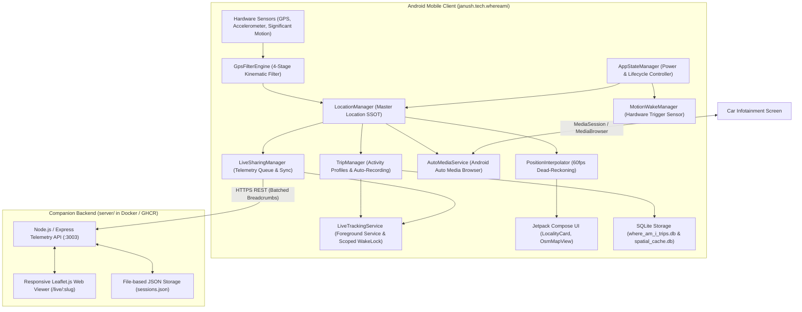

# WhereAmI - Technical Architecture Document (TAD)

This document is the authoritative, comprehensive technical architecture specification for the **WhereAmI** platform (`janush.tech.whereami`). It establishes the system architecture, component boundaries, data flows, core technical decisions (ADRs), code quality rules, and testing requirements.

---

## 1. Executive Summary & Core Mission

### Core Value Proposition (Non-Negotiable)
WhereAmI is designed for **ultra-fast, unambiguous, and reliable real-time spatial awareness** across Android, Android Auto, and companion web viewers:
1. **Primary Locality Display**: Instantly and legibly showing the **current place name** (City, Town, Village, or Settlement) with its complete, unambiguous **structural administrative hierarchy** (Municipality `gm.`, County `pow.`, Voivodeship `woj.`, Country).
2. **Canonical Road / Street Display**: Instantly showing the canonical road designation (`DK52`, `DW946`, `A4`, `S7`, `E77` without house numbers on major corridors, or formatted residential streets `ul. Mickiewicza 12`).
3. **Core Supremacy**: All supplementary features (trip recording, live sharing, heat map overlays, GPX export, statistics) exist to support this primary experience. **Never compromise, regress, or visually obstruct the primary locality and road awareness display.**

---

## 2. High-Level Architecture & Component Map

The platform consists of two principal components: the Android Native Application and the Companion Live Sharing Backend.



---

## 3. Technology Stack & Framework Inventory

| Layer | Technology | Version / Specification | Rationale & Purpose |
| :--- | :--- | :--- | :--- |
| **Language & Toolchain** | Kotlin | `2.0.21` (JVM Toolchain 17) | Modern, expressive, type-safe reactive development. |
| **Build System** | Gradle (KTS) | `8.11.1` (Android Gradle Plugin `8.8.0`) | Configuration-cache compliant, fast modular builds. |
| **Target SDKs** | Android SDK | `minSdk = 26` (Android 8.0), `targetSdk = 36` | Broad device coverage down to Android 8.0; modern Android 15/16/17 compatibility. |
| **UI Framework** | Jetpack Compose | Material 3 + Custom Design Tokens | Declarative reactive UI, custom floating map cards, dynamic aperture optical centering. |
| **Reactive Pipelines** | Kotlin Coroutines & Flow | `StateFlow`, `SharedFlow`, `SharingStarted.WhileSubscribed` | Structured concurrency, reactive UI updates, leak-free subscriptions. |
| **Map Rendering** | OSMDroid | `6.1.20` | Native offline/online OpenStreetMap tile rendering, customizable vector overlays, zero proprietary API fees. |
| **Location Provider** | Google Play Services Location | `21.3.0` (`FusedLocationProviderClient`) | Industry-standard GNSS Doppler velocity and high-accuracy positioning. |
| **Hardware Sensors** | Android Sensor Framework | `TYPE_SIGNIFICANT_MOTION`, `TYPE_ACCELEROMETER` | Hardware-level micro-power motion detection (~0 mW sensor hub sleep). |
| **Local Persistence** | SQLite | `SQLiteOpenHelper` (custom schema migrations) | High-performance, zero-overhead relational storage for trips, points, and spatial LRU cache. |
| **Companion Server** | Node.js / Express | Alpine Linux Docker Container (`ghcr.io`) | Lightweight, self-hostable on Synology NAS / VPS, REST telemetry synchronization. |
| **Web Map Viewer** | Leaflet.js | `1.9.4` | Fast, mobile-responsive, dependency-free browser tracking viewer. |
| **Testing** | JUnit 4, Kotlin Test | Unit test suites in `app/src/test/java/` | Automated unit testing for all kinematic, parsing, filtering, and interpolation logic. |

---

## 4. Core Subsystems Deep Dive

### A. Master Location Pipeline (Single Source of Truth)
All raw location fixes enter through `LocationManager.kt` via `masterLocationFlow`:
- **Fast Snapshot Emission**: Emits immediately upon GPS fix arrival with cached/committed locality metadata to eliminate UI lag.
- **Asynchronous Geocoding Decoupling**: Background geocoding enrichment runs asynchronously in `ioScope`. Crucially, async geocoding completions are **monotonically guarded** (`latestEnrichedTimestamp`) and **never re-emit past coordinates** into the kinematic map pipeline.
- **Flow Separation**:
  - `getLocationUpdates(language)`: Supplies enriched place names and administrative hierarchies for the Locality Card.
  - `getLocationRaw()`: Emits lightweight `LocationFix` instances with `.distinctUntilChanged` on `(lat, lng, timestamp)` strictly for real-time map tracking.

### B. 4-Stage GPS Kinematic Filter Engine (`GpsFilterEngine`)
Raw mobile GPS fixes undergo rigorous validation before being passed to UI, recording, or live streams:
1. **Horizontal Accuracy Gate**: Rejects fixes exceeding profile-specific thresholds (Driving $\le 55\text{m}$, Cycling $\le 55\text{m}$, Hiking $\le 40\text{m}$).
2. **Kinematic Velocity Gate**: Rejects displacement exceeding profile physical maximums (Driving $> 220\text{ km/h}$, Cycling $> 90\text{ km/h}$, Hiking $> 22\text{ km/h}$) when displacement $> 30\text{m}$.
3. **Consecutive Anomaly Recovery**: Allows instant relocation after 3 consecutive agreeing fixes (handles emerging from long tunnels or flight landings).
4. **Stationary Jitter Dampener**: Dampens micro-oscillations when stopped. When speed $< 1.2\text{ m/s}$ ($4.3\text{ km/h}$), freezes `lastValidBearing` to prevent compass spinning.

### C. 60fps Dead-Reckoning Position Interpolation (`PositionInterpolator`)
- Runs on the display frame clock (`withFrameNanos`) inside `OsmMapView.kt`.
- Projects position forward along the heading vector using flat-earth trigonometric projection ($v \times \Delta t$), capped at $2.5\text{s}$ to prevent runaway extrapolation during signal loss.
- Uses a $250\text{ms}$ ease-out blending window on new GPS fix arrivals to ensure zero visual jumping or snapping.
- Stationary dampening: locks position when velocity $< 0.35\text{ m/s}$ and throttles redraw to $350\text{ms}$ to save battery.

### D. Multi-Tier Geocoding, Road Snapping & Boundary Integrity
- **Precedence Hierarchy**: `OSRM Snapped Road` $\to$ `OSM Nominatim Vector Road` $\to$ `Android Platform Geocoder`.
- **High-Speed Corridor Inertia**: At speeds $> 35\text{ km/h}$ on major roads (`DK*`, `DW*`, `A*`, `S*`), requires at least 5 consecutive confirmations and $\ge 7.0\text{s}$ of sustained fixes before switching to a cross-street.
- **15-Second Decay Grace Period**: Preserves confirmed street identity for 15 seconds during temporary tunnel or signal cutouts; never blanks out or flickers.
- **Intentional Locality Visit Filter**: Commits a town/locality to trip history ONLY if the user penetrates $\ge 150\text{m}$ into the locality OR remains within it for $\ge 45\text{s}$. Skimming along border highways does not trigger false visits.
- **Spatial LRU Cache**: 4-decimal grid resolution (~11m cell resolution) in SQLite (`where_am_i_spatial_cache.db`) with strict 30-minute freshness TTL.

### E. Battery, Power Lifecycle & Sleep Architecture
Battery optimization is the highest engineering priority:
- **`AppStateManager` Lifecycle States**:
  - `IDLE`: Screen off, no active trip, no live sharing. **GPS hardware is completely powered down** (`LocationManager.stopLocationUpdates()`).
  - `FOREGROUND_VIEW`: Interactive map open (1500ms sampling; 3000ms on Battery Saver).
  - `TRIP_RECORDING`: Active trip in progress (profile-specific sampling: Car 5s/2s, Bike 15s/5s, Hike 8s/4s).
  - `LIVE_ONLY`: Live sharing active without local trip (12s on battery, 6s when charging).
  - `ANDROID_AUTO`: Infotainment screen active (3000ms / 1000ms).
- **Zero-Power Motion Wake (`MotionWakeManager`)**:
  - In `IDLE` state with `TripMode.AUTO`, arms Android's hardware `Sensor.TYPE_SIGNIFICANT_MOTION` trigger sensor.
  - The hardware sensor hub monitors motion while the main CPU and GNSS chip remain in deep sleep (~0 mW draw).
  - When locomotion occurs, triggers a temporary, activity-profile-adapted confirmation GPS burst (`(profile.autoStartDurationMs + 20_000L).coerceAtLeast(35_000L)`).
  - If speed criteria are sustained, the trip auto-starts. If motion was transient, GPS powers down and the sensor re-arms.
- **Scoped Wake Locks**:
  - `LiveTrackingService` acquires a `PARTIAL_WAKE_LOCK` strictly when a trip or live sharing session is active.
  - In standby or when stopped, wake locks are **immediately released**. No zombie wake locks are ever permitted.
- **Screen-Off MANUAL Mode**:
  - In `TripMode.MANUAL`, when screen is off with no active trip or live sharing, GPS and foreground services are completely stopped (Option A).

---

## 5. Architectural Decision Records (ADRs)

### ADR-01: SSOT Kinematic Decoupling from Asynchronous Geocoding
- **Context**: In field testing (2026-09-25), the map heading icon was jumping back and forth and snapping to 0 km/h. Diagnostics revealed `enrichedSnapshot` in `LocationManager.kt` was re-emitting past coordinates from asynchronous network closures (1-3s prior) back into the kinematic pipeline.
- **Decision**: Decouple kinematics from geocoding. `enrichedSnapshot` now strictly adopts current kinematics from `currentSnap`. `getLocationRaw()` outputs monotonic `LocationFix` instances filtered by `.distinctUntilChanged` on coordinates and timestamps. Geocoding completions never re-trigger map repositioning.
- **Consequences**: Zero teleportation, zero heading jitter, complete preservation of geocoding richness without visual side-effects.

### ADR-02: 60fps Dead-Reckoning Position Interpolation
- **Context**: Map repositioning previously executed discrete `animateTo(centerGp, 400L)` calls on every raw GPS fix (~1.5s). Each new fix aborted previous animations mid-flight, creating noticeable jerky stuttering.
- **Decision**: Implemented `PositionInterpolator.kt` running on the display frame clock (`withFrameNanos`). Forward-projects coordinates along heading vector using velocity and $\Delta t$, blended with a 250ms ease-out filter upon new fix arrival. Map center is updated directly with `setCenter(centerGp)` on display VSYNC.
- **Consequences**: Perfectly smooth 60fps movement across all speeds; map camera glides without interruption.

### ADR-03: Zero-Power Hardware Motion Wake & Scoped Wake Locks
- **Context**: Battery profiling revealed 3.89 mAh overnight drain (~58% of application layer draw, GNSS active 4m18s, wake lock held 7m17s) caused by a zombie foreground service and continuous GPS polling in AUTO mode.
- **Decision**:
  1. Fixed zombie service leak in `TripManager.stopTrip()`.
  2. Built `MotionWakeManager` using `Sensor.TYPE_SIGNIFICANT_MOTION` with `TriggerEventListener` (~0 mW sensor hub operation).
  3. In `IDLE`, GPS is powered down completely; locomotion wakes a 35s confirmation burst.
  4. `LiveTrackingService` wake locks are strictly scoped to active trips/sharing and released immediately in standby.
- **Consequences**: Overnight standby drain eliminated (~0 mAh when stationary); automatic trip detection preserved.

### ADR-04: Circular EMA Bearing Smoothing & Speed-Adaptive Tiered Gates
- **Context**: Low-speed driving ($\le 10\text{ km/h}$) produced $\pm 35^\circ$ bearing jitter, causing the map to spin 360° and the cursor arrow to wobble across the street.
- **Decision**: Implemented circular exponential moving average (`smoothBearing`) using vector $\sin/\cos$ decomposition to eliminate $0^\circ/360^\circ$ wraparound spikes. Governed by speed-adaptive $\alpha$ ($0.15 \to 0.80$) and tiered minimum speed gates ($3.0\text{ m/s} \to 8.0\text{ m/s}$ based on GPS accuracy).
- **Consequences**: Completely stable heading orientation at traffic lights and low-speed residential navigation.

### ADR-05: OSM & OSRM Vector Precedence over Platform Geocoder
- **Context**: Android Google Geocoder frequently returned obsolete rural cadastral hamlet names (e.g. `Krzemionki 8`) instead of the true road the vehicle was on (`Wincentego Witosa 14`).
- **Decision**: Inverted street resolution priority: `OSRM Snapped Road` $\to$ `OSM Nominatim Vector Road` $\to$ `Android Platform Geocoder`.
- **Consequences**: Street display strictly aligns with OpenStreetMap vector cartography and official Polish road numbers.

### ADR-06: 4-Decimal SQLite Spatial LRU Cache with Strict 30-Minute Expiry
- **Context**: A coarse spatial cache key (~111m) returned stale street names on sharp turns, and indefinite caching locked in temporary geocoding errors across sessions.
- **Decision**: Refined spatial cache resolution to 4 decimal places (~11m x ~7m cell resolution) in SQLite. Enforced strict 30-minute expiry (`maxAgeMs = 30 * 60 * 1000L`) during online operation, reserving indefinite fallback strictly for offline scenarios.
- **Consequences**: Instant turn recognition with offline resilience and protection against permanent stale data corruption.

---

## 6. Code Quality, Testing Gates & Coverage Requirements

### Mandatory Unit Testing Policy
- **Every algorithmic rule, mathematical filter, data transformation, parser, or state machine MUST have automated unit tests in `app/src/test/java/`**.
- Tests must execute in the local JVM without requiring an attached Android device or emulator.
- Existing Test Suites:
  - `PositionInterpolatorTest.kt`: Validates dead-reckoning extrapolation, stationary dampening, ease-out blending, and timeout caps.
  - `BatteryOptimizationAndAutoStartTest.kt`: Validates all activity profile auto-start thresholds, candidate evaluation, burst durations, and lifecycle semantics.
  - `BearingSmootherTest.kt`: Validates circular EMA smoothing, $\sin/\cos$ angular difference math, speed-adaptive $\alpha$, and tiered bearing gates.
  - `RoadNameNormalizerTest.kt`: Validates canonical abbreviations (`DK*`, `DW*`, `A*`, `S*`, `E*`) and house number filtering.
  - `TripSplitTest.kt`: Validates pause splitting, trip merging, and pause deletion.
  - `HierarchyResolutionTest.kt`: Validates administrative hierarchy formatting and deduplication.
  - `BoundaryRankingTest.kt`: Validates Nominatim boundary polygon ranking heuristics.
  - `SpatialCacheGridTest.kt`: Validates 4-decimal spatial grid key quantization and freshness TTL.
  - `StationaryDetectorTest.kt`: Validates accelerometer variance calculation for surface stability detection.

### Pre-Completion Build Gates (Strict Enforcement)
Before committing or reporting any feature or bug fix as complete, the agent MUST run:
```bash
# macOS / Linux:
./gradlew testDebugUnitTest assembleDebug

# Windows:
.\gradlew.bat testDebugUnitTest assembleDebug
```
Both commands must finish with `BUILD SUCCESSFUL` (0 test failures, 0 compilation errors).

---

## 7. Governance, Operational Rules & Git Lifecycle

- **No Direct Pushes to `master`**: All development occurs on dedicated feature branches (`feat/<name>`) or bugfix branches (`fix/<name>`).
- **Feature Branch Lifecycle**:
  1. `git checkout master && git pull origin master`
  2. `git checkout -b <type>/<descriptive-name>`
  3. Implement code, write unit tests, run build gates (`testDebugUnitTest assembleDebug`).
  4. Commit with conventional commit messages (`feat: ...`, `fix: ...`, `docs: ...`).
  5. Merge to `master` with `--no-ff` and push to GitHub **only upon explicit user instruction**.
- **Deployment Safeguards**:
  - Never push to GitHub without explicit user approval.
  - Never install APKs to the user's phone without explicit user approval.
- **Documentation Maintenance**:
  - Update `docs/ENHANCEMENT_TRACKER.md` after completing each milestone or phase.
  - Keep `docs/FEATURES_INVENTORY.md` updated as features evolve or retire.
  - Keep this `docs/ARCHITECTURE.md` updated when major architectural decisions are made.
